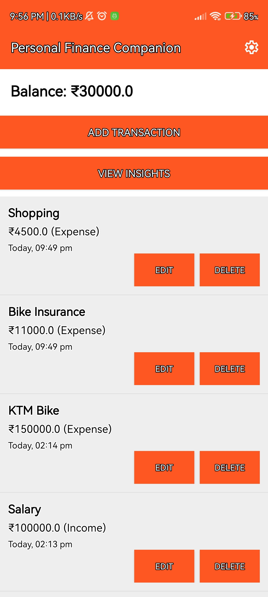
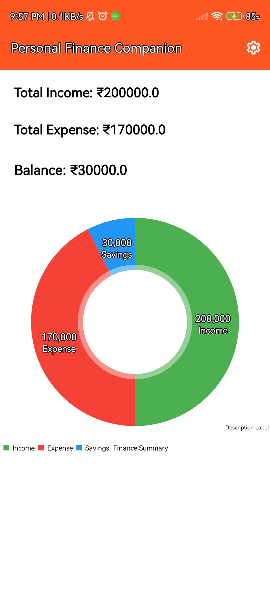

# 💰 Personal Finance Companion App

A simple yet powerful Android application built using Java that helps users track their daily income and expenses, manage their balance, and gain meaningful financial insights through intuitive visualizations.

---

## 📱 Features

### ➕ Add Transactions
- Add income or expense with title and amount
- Select transaction type (Income / Expense)
- Automatic timestamp (date & time)

### ✏️ Edit & Delete Transactions
- Update existing transactions easily
- Delete transactions with proper handling
- Changes reflect instantly across the app

### 💵 Balance Management
- Real-time balance calculation
- Prevents adding expenses greater than available balance
- Ensures logical and safe financial tracking

### 📊 Insights Dashboard
- Visual representation using Pie Chart
- Displays:
  - Total Income
  - Total Expense
  - Savings (Income - Expense)
- Clean and modern UI with meaningful color coding:
  - 🟢 Income
  - 🔴 Expense
  - 🔵 Savings

### 🕒 Smart Timestamp Display
- Shows transactions with date & time
- Supports user-friendly formats like Today / Yesterday

---

## 🧠 Tech Stack

- **Language:** Java
- **UI:** XML (ViewBinding)
- **Database:** SQLite (Local Storage)
- **Charts:** MPAndroidChart
- **Architecture:** Activity-based (Single module)

---

## ⚙️ Key Functionalities

- All data is stored locally using SQLite
- No external APIs or backend required
- Automatic data synchronization between screens
- Efficient CRUD operations (Create, Read, Update, Delete)

---

## 🖼️ Screenshots

### 🔹 Home Screen

### 🔹 Add Transaction (Expense)
![Expense]AddTransaction(Expense).jpg
![Income]AddTransaction(Income).jpg

### 🔹 Insights Dashboard

### 🔹 Change Theme
.jpg)
.jpg)

---

## 🚀 How It Works

1. User adds income or expense
2. Data is stored in SQLite database
3. Main screen displays all transactions and balance
4. Insights screen fetches same data and visualizes it
5. Any edit/delete updates all screens instantly

---

## ⚠️ Validation & Edge Handling

- Prevents expenses exceeding available balance
- Handles invalid inputs safely
- Maintains data consistency during edit operations

---

## 📌 Future Improvements

- Category-wise expense tracking
- Monthly trends and analytics
- Budget planning and alerts
- Cloud sync / backup

---

## 👨‍💻 Author

Developed as part of an Android internship assignment to demonstrate:
- Strong understanding of Android fundamentals
- Clean UI/UX design
- Practical problem-solving and validation logic

---

## ⭐ Conclusion

This project focuses on building a real-world usable finance tracker with a strong emphasis on:
- Simplicity
- Accuracy
- User experience

It showcases the ability to design, develop, and optimize a complete Android application from scratch.
